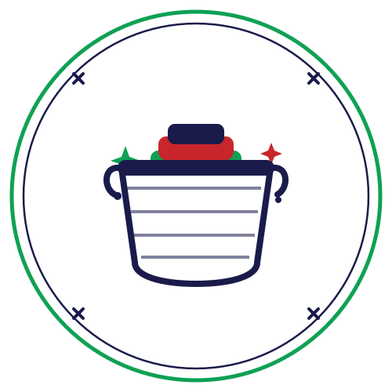

<p align="center">
  
</p>

<h1 align="center">AUN E-Laundry</h1>

<p align="center">
  A centralised campus laundry-management platform for the American University of Nigeria (AUN), Yola.<br>
  <em>Senior Design Project — School of Information Technology &amp; Computing.</em>
</p>

---

## Overview

AUN E-Laundry replaces the informal, manual campus laundry process with a single digital platform that
connects **students**, **laundry workers**, and **administrators**. It brings transparent university
pricing, verified workers, real-time order tracking, two-way ratings, and a structured complaint process
to campus resident life.

## Key features

### 👤 Students
- Register with role, residence hall, and phone number
- Browse **verified** workers in their dorm, ranked by rating
- Build an order with a **live price calculator** — priced from the official university rate
- Track orders through a live status timeline (placed → accepted → picked up → washing → ironing → ready → completed)
- Cancel pending orders, **rate** workers, and **file complaints**

### 🧺 Laundry workers
- Register (accounts require **admin approval** before receiving orders)
- Accept / reject incoming orders and advance them through the laundry pipeline
- Toggle availability (available / busy)
- Manage profile & bio, view rating and throughput stats
- Rate students after completion

### 🛡️ Administrators
- Approve or revoke worker accounts
- Manage the official **price list** and **residence halls**
- Monitor **all orders** across dorms with filters
- Triage and resolve **complaints**

### Shared
- Role-based access control · in-app notification bell · AUN-branded UI

## Tech stack

| Layer | Technology |
|-------|-----------|
| Framework | Laravel 12 (PHP 8.2+) |
| Auth | Laravel Breeze (Blade) |
| Frontend | Blade, Tailwind CSS, Alpine.js, Vite |
| Database | MySQL |
| Testing | Pest (65 feature tests) |

## Getting started

**Requirements:** PHP 8.2+, Composer, Node.js + npm, MySQL.

```bash
# 1. Install dependencies
composer install
npm install

# 2. Configure environment
cp .env.example .env
php artisan key:generate
# then set DB_DATABASE / DB_USERNAME / DB_PASSWORD in .env

# 3. Create the schema and demo data
php artisan migrate --seed

# 4. Build assets
npm run build      # or: npm run dev

# 5. Serve
php artisan serve  # http://localhost:8000
```

### Demo accounts (password: `password`)

| Role | Email |
|------|-------|
| Admin | `admin@aun.edu.ng` |
| Worker (approved) | `worker@aun.edu.ng` |
| Worker (pending approval) | `pending@aun.edu.ng` |
| Student | `student@aun.edu.ng` |

> Seeded dorm names and price-list rates are **placeholders** — replace them with the real
> AUN values from the admin screens (Dorms and Price List).

## Running the tests

```bash
php artisan test
```

## Data model (core tables)

`users` (role, dorm, phone) · `dorms` · `service_items` (price list) · `worker_profiles`
(approval + cached stats) · `orders` · `order_items` (price-snapshotted) · `order_status_history`
· `ratings` (two-way) · `complaints` · `notifications`.

## Configuration notes

- **Google Analytics** — optional. Set `GOOGLE_ANALYTICS_ID=G-XXXXXXXXXX` in `.env` to enable tracking.
- **Pricing is server-authoritative** — order totals are always recomputed from the official
  price list; client-supplied prices are ignored.

## Team

| Name | ID |
|------|-----|
| Ibrahim Abdulmajeed Ibrahim | A00024501 |
| Audu David Utennami | A00023995 |
| Vanje Kefas Zawaya | A00024352 |

## Credits

Campus photographs on the landing page are sourced from the public
[aun.edu.ng](https://www.aun.edu.ng) website and remain the property of the American University of Nigeria.

## License

Academic project — American University of Nigeria. Built on the open-source
[Laravel](https://laravel.com) framework (MIT).
